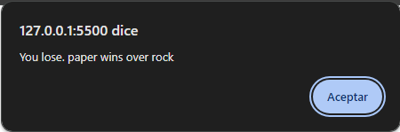

# Rock, paper and scissors
 
This current game it's simple. The player can choose between three options: rock, paper and scissors.

-When you choose an option, the game will automatically choose a random option for the second player. Depending on the player's choice and the random selection, it will tell us if we won or lost the game.

-Theres a lost game example:

-And a draw:

